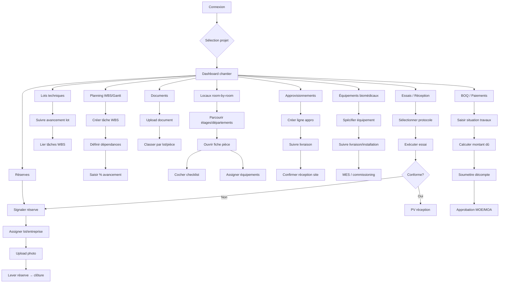

# ARCHI HOSP — Plan d'exécution MVP

> Plateforme de pilotage de chantier hospitalier — K'BIO Conseil  
> Version : MVP v0.1 | Date : 2026-06-13

---

## 1. Arborescence complète du projet

```
archi-hosp/
├── .cursor/
│   └── rules/
│       └── archi-hosp.mdc              # Conventions projet
├── docs/
│   ├── PLAN_ARCHITECTURE.md            # Ce document
│   ├── WORKFLOWS.md                    # Parcours utilisateur détaillés
│   └── CALCULS_AVANCEMENT.md           # Formules métier
├── supabase/
│   ├── config.toml
│   ├── migrations/
│   │   ├── 00001_init_schema.sql       # Tables core + enums
│   │   ├── 00002_rls_policies.sql      # Row Level Security
│   │   └── 00003_seed_demo.sql         # Données démo CHUD-type
│   └── seed.sql
├── public/
│   ├── logo-kbio.svg
│   └── uploads/                        # Fallback local (dev)
├── src/
│   ├── app/
│   │   ├── (auth)/
│   │   │   ├── login/page.tsx
│   │   │   ├── register/page.tsx
│   │   │   └── forgot-password/page.tsx
│   │   ├── (dashboard)/
│   │   │   ├── layout.tsx              # Sidebar + header chantier
│   │   │   ├── page.tsx                # Dashboard chantier
│   │   │   ├── planning/
│   │   │   │   ├── page.tsx            # WBS + Gantt
│   │   │   │   └── [taskId]/page.tsx
│   │   │   ├── lots/
│   │   │   │   ├── page.tsx
│   │   │   │   └── [lotId]/page.tsx
│   │   │   ├── locaux/
│   │   │   │   ├── page.tsx            # Liste étages / départements
│   │   │   │   └── [roomId]/page.tsx   # Fiche room-by-room
│   │   │   ├── reserves/
│   │   │   │   ├── page.tsx
│   │   │   │   └── [reserveId]/page.tsx
│   │   │   ├── documents/
│   │   │   │   └── page.tsx
│   │   │   ├── approvisionnements/
│   │   │   │   ├── page.tsx
│   │   │   │   └── [orderId]/page.tsx
│   │   │   ├── equipements/
│   │   │   │   ├── page.tsx
│   │   │   │   └── [equipmentId]/page.tsx
│   │   │   ├── essais/
│   │   │   │   ├── page.tsx
│   │   │   │   └── [testId]/page.tsx
│   │   │   ├── boq/
│   │   │   │   ├── page.tsx
│   │   │   │   └── paiements/page.tsx
│   │   │   └── settings/
│   │   │       ├── page.tsx
│   │   │       ├── team/page.tsx
│   │   │       └── project/page.tsx
│   │   ├── api/
│   │   │   ├── projects/[id]/progress/route.ts
│   │   │   └── webhooks/supabase/route.ts
│   │   ├── layout.tsx
│   │   └── globals.css
│   ├── components/
│   │   ├── ui/                         # shadcn/ui
│   │   ├── layout/
│   │   │   ├── app-sidebar.tsx
│   │   │   ├── app-header.tsx
│   │   │   ├── project-switcher.tsx
│   │   │   └── breadcrumb-nav.tsx
│   │   ├── dashboard/
│   │   │   ├── kpi-cards.tsx
│   │   │   ├── progress-ring.tsx
│   │   │   ├── alerts-panel.tsx
│   │   │   └── recent-activity.tsx
│   │   ├── planning/
│   │   │   ├── wbs-tree.tsx
│   │   │   ├── gantt-chart.tsx
│   │   │   ├── task-form.tsx
│   │   │   └── dependency-editor.tsx
│   │   ├── lots/
│   │   │   ├── lot-card.tsx
│   │   │   ├── lot-progress-bar.tsx
│   │   │   └── lot-detail-tabs.tsx
│   │   ├── locaux/
│   │   │   ├── floor-plan-grid.tsx
│   │   │   ├── room-card.tsx
│   │   │   ├── room-status-badge.tsx
│   │   │   └── room-checklist.tsx
│   │   ├── reserves/
│   │   │   ├── reserve-table.tsx
│   │   │   ├── reserve-form.tsx
│   │   │   ├── reserve-kanban.tsx
│   │   │   └── reserve-photo-upload.tsx
│   │   ├── documents/
│   │   │   ├── document-tree.tsx
│   │   │   ├── document-upload.tsx
│   │   │   └── document-preview.tsx
│   │   ├── approvisionnements/
│   │   │   ├── procurement-table.tsx
│   │   │   ├── delivery-tracker.tsx
│   │   │   └── supplier-badge.tsx
│   │   ├── equipements/
│   │   │   ├── equipment-table.tsx
│   │   │   ├── equipment-form.tsx
│   │   │   ├── commissioning-status.tsx
│   │   │   └── room-equipment-map.tsx
│   │   ├── essais/
│   │   │   ├── test-protocol-list.tsx
│   │   │   ├── test-result-form.tsx
│   │   │   └── reception-checklist.tsx
│   │   ├── boq/
│   │   │   ├── boq-table.tsx
│   │   │   ├── payment-schedule.tsx
│   │   │   ├── invoice-form.tsx
│   │   │   └── budget-vs-actual.tsx
│   │   └── shared/
│   │       ├── data-table.tsx
│   │       ├── status-badge.tsx
│   │       ├── progress-bar.tsx
│   │       ├── date-range-picker.tsx
│   │       ├── file-dropzone.tsx
│   │       ├── empty-state.tsx
│   │       ├── confirm-dialog.tsx
│   │       └── export-button.tsx
│   ├── lib/
│   │   ├── supabase/
│   │   │   ├── client.ts
│   │   │   ├── server.ts
│   │   │   └── middleware.ts
│   │   ├── calculations/
│   │   │   ├── progress.ts             # Formules avancement
│   │   │   └── boq.ts                  # Calculs financiers
│   │   ├── validations/
│   │   │   ├── task.schema.ts
│   │   │   ├── room.schema.ts
│   │   │   ├── reserve.schema.ts
│   │   │   └── equipment.schema.ts
│   │   ├── constants/
│   │   │   ├── roles.ts
│   │   │   ├── statuses.ts
│   │   │   └── lot-types.ts
│   │   └── utils.ts
│   ├── hooks/
│   │   ├── use-project.ts
│   │   ├── use-permissions.ts
│   │   └── use-progress.ts
│   └── types/
│       ├── database.types.ts           # Généré Supabase
│       └── index.ts
├── middleware.ts                       # Auth guard
├── next.config.ts
├── package.json
├── tailwind.config.ts
├── tsconfig.json
└── .env.local.example
```

---

## 2. Modèle de données PostgreSQL

### 2.1 Enums

```sql
-- Rôles applicatifs (stockés dans profiles.role, pas user_metadata)
CREATE TYPE app_role AS ENUM (
  'admin',           -- Admin K'BIO / MOA
  'project_manager', -- Chef de projet
  'site_manager',    -- Conducteur travaux
  'lot_manager',     -- Responsable lot
  'biomedical',      -- Ingénieur biomédical
  'supplier',        -- Fournisseur (lecture limitée)
  'controller',      -- Contrôleur / MOE
  'viewer'           -- Lecture seule
);

CREATE TYPE project_status AS ENUM ('draft','active','suspended','completed','archived');
CREATE TYPE task_status AS ENUM ('not_started','in_progress','blocked','completed','cancelled');
CREATE TYPE lot_status AS ENUM ('planned','tendering','awarded','in_progress','completed');
CREATE TYPE room_status AS ENUM ('shell','rough_in','finishes','equipment','testing','handover','occupied');
CREATE TYPE reserve_status AS ENUM ('open','in_progress','validated','closed','rejected');
CREATE TYPE reserve_priority AS ENUM ('critical','major','minor','info');
CREATE TYPE document_category AS ENUM ('plan','spec','report','certificate','contract','photo','other');
CREATE TYPE procurement_status AS ENUM ('requested','ordered','in_transit','delivered','installed','accepted');
CREATE TYPE equipment_status AS ENUM ('specified','ordered','delivered','installed','commissioned','accepted');
CREATE TYPE test_status AS ENUM ('planned','in_progress','passed','failed','conditional');
CREATE TYPE payment_status AS ENUM ('planned','submitted','approved','paid','disputed');
CREATE TYPE boq_unit AS ENUM ('u','m','m2','m3','kg','l','forfait','h');
```

### 2.2 Tables core

| Table | Description | Clés |
|-------|-------------|------|
| `organizations` | MOA, MOE, entreprises | id |
| `profiles` | Extension auth.users | id → auth.users |
| `organization_members` | Appartenance org | org_id, user_id |
| `projects` | Chantier hospitalier | id, org_id |
| `project_members` | Accès projet + rôle | project_id, user_id, role |

### 2.3 Planning (WBS + Gantt)

| Table | Description |
|-------|-------------|
| `wbs_nodes` | Arbre WBS (phase > lot > tâche) |
| `tasks` | Tâches planifiables (dates, % avancement) |
| `task_dependencies` | Liens FS/SS/FF/SF entre tâches |
| `task_assignments` | Ressources / responsables |
| `milestones` | Jalons contractuels |

```
wbs_nodes: id, project_id, parent_id, code, name, level, sort_order
tasks: id, wbs_node_id, project_id, name, status, progress_pct,
       planned_start, planned_end, actual_start, actual_end,
       duration_days, is_critical, lot_id (FK nullable)
task_dependencies: id, predecessor_id, successor_id, type, lag_days
```

### 2.4 Lots techniques

| Table | Description |
|-------|-------------|
| `lots` | Lots GO, CFO, CVC, fluides médicaux, élec, biomédical… |
| `lot_contractors` | Entreprises titulaires / sous-traitants |
| `lot_deliverables` | Livrables attendus par lot |

```
lots: id, project_id, code, name, trade_type, status, progress_pct,
      contract_amount, planned_start, planned_end
lot_contractors: lot_id, organization_id, role ('main'|'sub')
```

### 2.5 Locaux (room-by-room)

| Table | Description |
|-------|-------------|
| `buildings` | Bâtiments |
| `storeys` | Étages / niveaux |
| `departments` | Services (bloc, stérilisation, imagerie…) |
| `rooms` | Pièces unitaires |
| `room_checklists` | Points de contrôle par pièce |
| `room_checklist_items` | Items cochables |

```
rooms: id, project_id, storey_id, department_id, code, name,
       room_type, area_m2, status, progress_pct,
       polygon_coordinates (jsonb), height_m,
       cleanroom_class, medical_gas_required
room_checklists: room_id, template_name
room_checklist_items: checklist_id, label, category, is_done, done_at, done_by
```

### 2.6 Réserves (punch list)

| Table | Description |
|-------|-------------|
| `reserves` | Anomalies / réserves |
| `reserve_photos` | Photos preuves |
| `reserve_comments` | Fil de discussion |

```
reserves: id, project_id, room_id, lot_id, title, description,
          status, priority, reported_by, assigned_to,
          due_date, closed_at, location_detail
```

### 2.7 Documents

| Table | Description |
|-------|-------------|
| `document_folders` | Arborescence DCE / DOE / OPR |
| `documents` | Fichiers + métadonnées |
| `document_versions` | Versioning |

```
documents: id, project_id, folder_id, name, category, file_path,
           version, uploaded_by, lot_id, room_id (nullable FKs)
```

### 2.8 Approvisionnements

| Table | Description |
|-------|-------------|
| `procurement_items` | Lignes d'approvisionnement |
| `procurement_deliveries` | Livraisons partielles |
| `suppliers` | Fournisseurs |

```
procurement_items: id, project_id, lot_id, reference, description,
                   supplier_id, qty_ordered, qty_delivered, unit,
                   status, expected_date, actual_date, room_id
```

### 2.9 Équipements biomédicaux

| Table | Description |
|-------|-------------|
| `equipment_catalog` | Catalogue types (pendentif, autoclave…) |
| `equipment_instances` | Instances projet |
| `equipment_room_placements` | Placement room-by-room |
| `equipment_commissioning` | Mise en service |

```
equipment_instances: id, project_id, catalog_id, asset_code,
                     manufacturer, model, serial_number,
                     status, room_id, lot_id,
                     acquisition_date, warranty_end,
                     criticality ('A'|'B'|'C'), device_class ('I'|'IIa'|'IIb'|'III')
equipment_commissioning: equipment_id, protocol_name, status,
                         test_date, technician, report_doc_id
```

### 2.10 Essais / Réception

| Table | Description |
|-------|-------------|
| `test_protocols` | Protocoles (OPR, fluides, ventilation…) |
| `test_runs` | Exécutions d'essais |
| `test_results` | Résultats par critère |
| `reception_sessions` | PV de réception partielle / globale |

```
test_protocols: id, project_id, lot_id, name, norm_reference, room_id
test_runs: id, protocol_id, status, scheduled_date, executed_date, executor_id
test_results: run_id, criterion, expected_value, actual_value, passed
reception_sessions: id, project_id, type ('partial'|'global'), date, status
```

### 2.11 BOQ / Paiements

| Table | Description |
|-------|-------------|
| `boq_items` | Bordereau quantitatif |
| `boq_progress_entries` | Situations de travaux |
| `payments` | Paiements / décomptes |
| `budget_lines` | Budget initial vs révisé |

```
boq_items: id, project_id, lot_id, code, description, unit,
           qty_contract, unit_price, amount,
           qty_executed, qty_invoiced
payments: id, project_id, lot_id, reference, period_start, period_end,
          amount_ht, amount_ttc, status, submitted_at, approved_at
```

### 2.12 Audit

| Table | Description |
|-------|-------------|
| `activity_logs` | Traçabilité actions |
| `progress_snapshots` | Snapshots hebdo avancement |

---

## 3. Liste des pages

| Route | Page | Description |
|-------|------|-------------|
| `/login` | Connexion | Email + mot de passe Supabase Auth |
| `/register` | Inscription | Invitation-only (MVP) |
| `/forgot-password` | Mot de passe oublié | Reset email |
| `/` | Dashboard chantier | KPIs, alertes, synthèse avancement |
| `/planning` | WBS + Gantt | Arbre WBS + diagramme Gantt interactif |
| `/planning/[taskId]` | Détail tâche | Dates, dépendances, % avancement |
| `/lots` | Lots techniques | Grille lots + avancement |
| `/lots/[lotId]` | Détail lot | Entreprise, livrables, tâches liées |
| `/locaux` | Locaux | Vue étages / départements |
| `/locaux/[roomId]` | Fiche pièce | Room-by-room : statut, checklist, équipements, réserves |
| `/reserves` | Réserves | Table + kanban punch list |
| `/reserves/[reserveId]` | Détail réserve | Photos, commentaires, clôture |
| `/documents` | Documents | Arborescence + upload |
| `/approvisionnements` | Approvisionnements | Suivi commandes / livraisons |
| `/approvisionnements/[orderId]` | Détail commande | Lignes, livraisons partielles |
| `/equipements` | Équipements biomédicaux | Inventaire chantier |
| `/equipements/[equipmentId]` | Fiche équipement | MES, placement, docs |
| `/essais` | Essais / réception | Protocoles et résultats |
| `/essais/[testId]` | Détail essai | Critères, PV |
| `/boq` | BOQ | Bordereau quantitatif |
| `/boq/paiements` | Paiements | Décomptes et situations |
| `/settings` | Paramètres | Profil utilisateur |
| `/settings/team` | Équipe projet | Membres + rôles |
| `/settings/project` | Projet | Infos chantier, dates contractuelles |

---

## 4. Liste des composants UI

### Layout (6)
- `AppSidebar` — Navigation modules + project switcher
- `AppHeader` — Breadcrumb, notifications, profil
- `ProjectSwitcher` — Sélection chantier actif
- `BreadcrumbNav` — Fil d'Ariane
- `MobileNav` — Navigation responsive
- `ThemeToggle` — Mode clair/sombre

### Dashboard (5)
- `KpiCards` — Avancement global, budget, réserves ouvertes, jalons
- `ProgressRing` — Anneau avancement par lot
- `AlertsPanel` — Retards, réserves critiques, livraisons en retard
- `RecentActivity` — Flux activité
- `MilestoneTimeline` — Jalons à venir

### Planning (5)
- `WbsTree` — Arbre WBS expandable (drag reorder MVP+)
- `GanttChart` — Diagramme Gantt (lib: `@wamra/gantt-task-react` ou custom SVG)
- `TaskForm` — CRUD tâche
- `DependencyEditor` — Liens prédécesseur/successeur
- `CriticalPathBadge` — Indicateur chemin critique

### Lots (3)
- `LotCard` — Carte lot avec barre avancement
- `LotProgressBar` — Avancement pondéré
- `LotDetailTabs` — Onglets : infos, tâches, BOQ, documents

### Locaux (4)
- `FloorPlanGrid` — Grille pièces par étage
- `RoomCard` — Carte pièce + statut couleur
- `RoomStatusBadge` — Badge statut (shell → occupied)
- `RoomChecklist` — Checklist cochable par pièce

### Réserves (4)
- `ReserveTable` — Table filtrable
- `ReserveForm` — Création / édition
- `ReserveKanban` — Vue colonnes par statut
- `ReservePhotoUpload` — Upload photos preuves

### Documents (3)
- `DocumentTree` — Arborescence dossiers
- `DocumentUpload` — Dropzone + catégorisation
- `DocumentPreview` — Aperçu PDF/image

### Approvisionnements (3)
- `ProcurementTable` — Table commandes
- `DeliveryTracker` — Timeline livraisons
- `SupplierBadge` — Badge fournisseur

### Équipements (4)
- `EquipmentTable` — Inventaire filtrable
- `EquipmentForm` — Saisie équipement
- `CommissioningStatus` — Statut MES
- `RoomEquipmentMap` — Équipements par pièce

### Essais (3)
- `TestProtocolList` — Liste protocoles
- `TestResultForm` — Saisie résultats
- `ReceptionChecklist` — Checklist réception

### BOQ (4)
- `BoqTable` — Bordereau éditable
- `PaymentSchedule` — Échéancier paiements
- `InvoiceForm` — Saisie décompte
- `BudgetVsActual` — Budget vs réalisé

### Shared (8)
- `DataTable` — Table générique (TanStack Table)
- `StatusBadge` — Badge statut générique
- `ProgressBar` — Barre % configurable
- `DateRangePicker` — Sélecteur période
- `FileDropzone` — Upload drag & drop
- `EmptyState` — État vide
- `ConfirmDialog` — Confirmation destructive
- `ExportButton` — Export CSV/Excel

**Total MVP : ~52 composants**

---

## 5. Workflow utilisateur



### Parcours type — Semaine de chantier

1. **Lundi** : Chef de projet consulte dashboard → identifie 3 tâches en retard sur Gantt
2. **Mardi** : Conducteur travaux visite étage 2 → coche checklist 5 pièces → signale 2 réserves
3. **Mercredi** : Ingénieur biomédical valide réception 4 pendentifs → lance protocole MES
4. **Jeudi** : Responsable lot CVC soumet situation mensuelle → BOQ mis à jour
5. **Vendredi** : MOE valide 8 réserves levées → avancement global recalculé automatiquement

---

## 6. Rôles et permissions

| Permission | admin | project_manager | site_manager | lot_manager | biomedical | supplier | controller | viewer |
|------------|:-----:|:---------------:|:------------:|:-----------:|:----------:|:--------:|:----------:|:------:|
| Voir dashboard | ✅ | ✅ | ✅ | ✅ | ✅ | ⚠️ | ✅ | ✅ |
| Éditer planning WBS | ✅ | ✅ | ✅ | ⚠️ | ❌ | ❌ | ❌ | ❌ |
| Gérer lots | ✅ | ✅ | ✅ | ⚠️ | ❌ | ❌ | ❌ | ❌ |
| Éditer locaux/checklists | ✅ | ✅ | ✅ | ✅ | ⚠️ | ❌ | ⚠️ | ❌ |
| Créer réserves | ✅ | ✅ | ✅ | ✅ | ✅ | ⚠️ | ✅ | ❌ |
| Clôturer réserves | ✅ | ✅ | ✅ | ✅ | ⚠️ | ❌ | ✅ | ❌ |
| Upload documents | ✅ | ✅ | ✅ | ✅ | ✅ | ⚠️ | ✅ | ❌ |
| Gérer approvisionnements | ✅ | ✅ | ✅ | ✅ | ⚠️ | ⚠️ | ❌ | ❌ |
| Gérer équipements bio | ✅ | ✅ | ⚠️ | ❌ | ✅ | ❌ | ⚠️ | ❌ |
| Exécuter essais | ✅ | ✅ | ⚠️ | ⚠️ | ✅ | ❌ | ✅ | ❌ |
| Éditer BOQ | ✅ | ✅ | ❌ | ⚠️ | ❌ | ❌ | ✅ | ❌ |
| Approuver paiements | ✅ | ✅ | ❌ | ❌ | ❌ | ❌ | ✅ | ❌ |
| Gérer équipe/rôles | ✅ | ✅ | ❌ | ❌ | ❌ | ❌ | ❌ | ❌ |

⚠️ = Accès limité à son lot / ses pièces assignées (RLS Supabase)

### Implémentation RLS

- `project_members.role` détermine les droits
- Policies Supabase par table : `auth.uid() IN (SELECT user_id FROM project_members WHERE project_id = ...)`
- Lot managers : filtre additionnel `lot_id IN (SELECT lot_id FROM lot_assignments WHERE user_id = auth.uid())`
- Suppliers : lecture seule sur procurement_items + documents tagués

---

## 7. Calculs d'avancement

### 7.1 Avancement tâche (saisie manuelle MVP)

```
task.progress_pct ∈ [0, 100]  — saisi par responsable
```

### 7.2 Avancement nœud WBS (rollup)

```
wbs_node.progress = weighted_avg(children.progress, weight=children.planned_duration)
Si feuille sans tâche → moyenne des tasks liées
```

### 7.3 Avancement lot

```
lot.progress = 0.4 × wbs_progress(lot)
             + 0.3 × room_progress(lot)      -- pièces liées au lot
             + 0.2 × boq_progress(lot)       -- qty_executed / qty_contract
             + 0.1 × reserve_closure_rate    -- 1 - (open_reserves / total_reserves)
```

### 7.4 Avancement pièce (room-by-room)

```
room.progress = 0.5 × checklist_completion   -- items_done / items_total
              + 0.3 × equipment_installed    -- installed / planned equipment
              + 0.2 × reserves_closed        -- 1 - (open / total)
```

Statuts pièce (machine d'état) :
```
shell → rough_in → finishes → equipment → testing → handover → occupied
Chaque transition requiert checklist_completion ≥ seuil (80% MVP)
```

### 7.5 Avancement projet global

```
project.progress = Σ (lot.weight × lot.progress)
lot.weight = lot.contract_amount / Σ contract_amounts  (fallback: equal weight)
```

### 7.6 Avancement BOQ

```
boq_item.progress = qty_executed / qty_contract × 100
lot.boq_progress = Σ (item.amount × item.progress) / Σ item.amount
```

### 7.7 Taux réserves

```
reserve_closure_rate = closed_reserves / total_reserves × 100
reserve_overdue_rate = reserves WHERE due_date < today AND status != 'closed' / open_reserves
```

### 7.8 SPI / dérive planning (MVP+)

```
SPI = earned_value / planned_value
earned_value = Σ (task.budget × task.progress / 100)
planned_value = Σ (task.budget × planned_progress_at_date)
```

---

## 8. Priorités de développement MVP

### Sprint 0 — Fondations (Semaine 1)
| # | Livrable | Priorité |
|---|----------|----------|
| 0.1 | Scaffold Next.js 16 + Tailwind + shadcn/ui | P0 |
| 0.2 | Supabase : schema + RLS + seed démo | P0 |
| 0.3 | Auth (login, middleware, session) | P0 |
| 0.4 | Layout dashboard (sidebar, header) | P0 |

### Sprint 1 — Core métier (Semaine 2)
| # | Livrable | Priorité |
|---|----------|----------|
| 1.1 | Dashboard chantier (KPIs + alertes) | P0 |
| 1.2 | CRUD projets + membres | P0 |
| 1.3 | Lots techniques (liste + détail) | P0 |
| 1.4 | Module locaux room-by-room | P0 |

### Sprint 2 — Planning & suivi (Semaine 3)
| # | Livrable | Priorité |
|---|----------|----------|
| 2.1 | WBS tree | P0 |
| 2.2 | Gantt chart basique | P0 |
| 2.3 | Réserves (CRUD + kanban) | P0 |
| 2.4 | Calculs avancement (lib/progress.ts) | P0 |

### Sprint 3 — Supply chain & docs (Semaine 4)
| # | Livrable | Priorité |
|---|----------|----------|
| 3.1 | Documents (upload Supabase Storage) | P1 |
| 3.2 | Approvisionnements | P1 |
| 3.3 | Équipements biomédicaux | P1 |

### Sprint 4 — Réception & finance (Semaine 5)
| # | Livrable | Priorité |
|---|----------|----------|
| 4.1 | Essais / protocoles / réception | P1 |
| 4.2 | BOQ + paiements | P1 |
| 4.3 | Export CSV + snapshots avancement | P2 |

### Dépendances

```
Auth → Layout → Dashboard
              → Lots → WBS/Gantt
              → Locaux → Réserves → Essais
              → Équipements → Essais
              → Approvisionnements → Équipements
              → BOQ → Paiements
Documents (transversal, toutes phases)
```

---

## Stack technique retenue

| Couche | Technologie |
|--------|-------------|
| Frontend | Next.js 16 App Router, React 19, TypeScript |
| UI | shadcn/ui + Tailwind CSS 4, couleurs K'BIO (#003F72, #0891B2, #F97316) |
| Auth + DB | Supabase (Auth, PostgreSQL, Storage, RLS) |
| Tables | TanStack Table v8 |
| Gantt | Custom SVG MVP (upgrade lib ultérieur) |
| Validation | Zod |
| Forms | React Hook Form |
| Charts | Recharts |

---

*Document ARCHI HOSP — K'BIO Conseil — Confidentiel*
